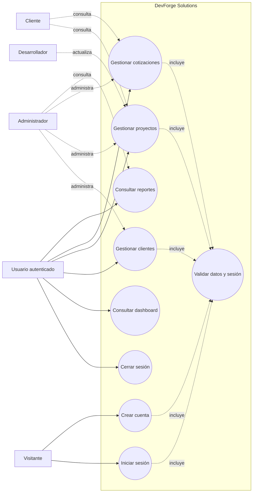
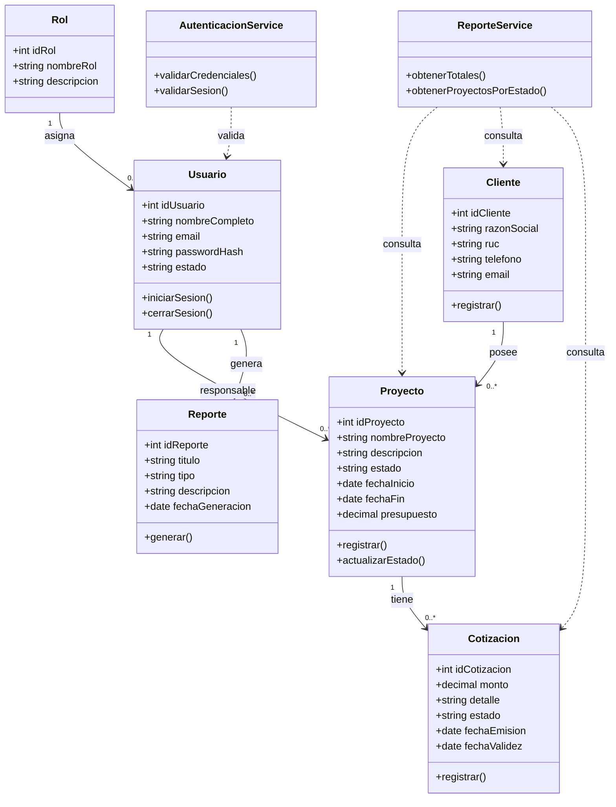
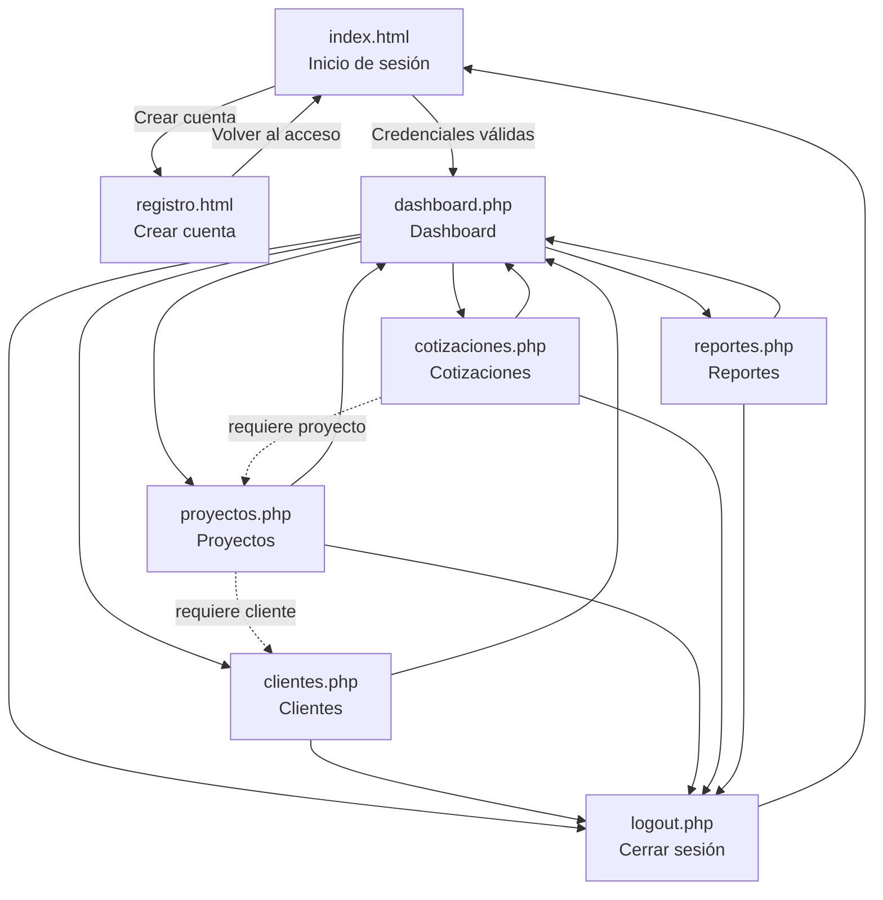

# Producto Académico N.° 03 - Proyecto
## DevForge Solutions

> **Continuidad con el PA2.** El proyecto corresponde a una aplicación web para centralizar la gestión de clientes, proyectos, cotizaciones y reportes de una empresa de desarrollo de soluciones digitales. La implementación del PA2 evidencia autenticación de usuarios, panel principal, registro de clientes, registro y seguimiento de proyectos, elaboración de cotizaciones y consulta de indicadores.

## c. Metodología a utilizar

### Metodología propuesta: Scrum con desarrollo incremental y prototipado evolutivo

Se utilizará **Scrum**, adaptado a un equipo académico pequeño, junto con un desarrollo incremental. Esta elección es coherente con DevForge Solutions porque el sistema está compuesto por módulos independientes, pero relacionados: autenticación, clientes, proyectos, cotizaciones y reportes. Cada módulo puede construirse, validarse y entregarse en un incremento funcional.

El prototipado evolutivo permitirá mostrar tempranamente las pantallas al usuario y ajustar los formularios, mensajes, estados y reportes antes de cerrar la versión final. Esto es especialmente importante en un sistema de gestión, donde la utilidad depende de que la información pueda registrarse y consultarse con rapidez.

### Aplicación de Scrum al proyecto

| Elemento | Aplicación en DevForge Solutions |
|---|---|
| Product Backlog | Historias de usuario para iniciar sesión, registrar clientes, crear proyectos, elaborar cotizaciones y consultar reportes. |
| Sprint | Iteraciones cortas de una o dos semanas, cada una con un objetivo verificable. |
| Priorización | Primero se implementan acceso y datos maestros; después, proyectos, cotizaciones y reportes. |
| Revisión | Al finalizar cada sprint se demuestra el incremento usando datos de prueba. |
| Retrospectiva | El equipo registra problemas de usabilidad, validación, seguridad y consistencia de datos. |
| Definition of Done | Funcionalidad implementada, validada, conectada a MySQL, protegida por sesión y comprobada mediante pruebas. |

### Incrementos propuestos

1. **Incremento 1: acceso y estructura base.** Registro, inicio y cierre de sesión, validación de sesión y conexión con MySQL.
2. **Incremento 2: gestión comercial.** Registro y consulta de clientes.
3. **Incremento 3: gestión operativa.** Registro de proyectos, responsable, cliente, presupuesto y estado.
4. **Incremento 4: gestión financiera.** Registro y consulta de cotizaciones asociadas a proyectos.
5. **Incremento 5: información gerencial.** Dashboard y reportes con totales, ingresos proyectados y proyectos por estado.
6. **Incremento 6: estabilización.** Pruebas, corrección de errores, revisión de seguridad, accesibilidad y experiencia de usuario.

### Sustento

Scrum permite responder a cambios sin rehacer todo el sistema, porque cada entrega tiene un alcance acotado y verificable. El desarrollo incremental reduce el riesgo de descubrir al final que los formularios o reportes no responden a las necesidades del negocio. Además, el prototipado evolutivo mantiene la relación entre los requerimientos del PA2 y la interfaz implementada.

## d. Método de evaluación del proyecto

Se aplicará una **evaluación mixta**, compuesta por pruebas funcionales de caja negra, evaluación de usabilidad y revisión de calidad técnica.

### 1. Pruebas funcionales de caja negra

Se verificará el comportamiento observable del sistema sin depender de su implementación interna.

| Caso | Resultado esperado |
|---|---|
| Inicio de sesión con credenciales válidas | El usuario accede al dashboard y se crea una sesión. |
| Inicio de sesión con credenciales inválidas | El sistema rechaza el acceso y muestra el mensaje correspondiente. |
| Acceso directo a un módulo sin sesión | El sistema redirige al inicio de sesión. |
| Registro de cliente con razón social | El cliente queda almacenado y aparece en el directorio. |
| Registro de cliente con RUC repetido | El sistema informa el conflicto y no duplica el registro. |
| Registro de proyecto sin datos obligatorios | El sistema rechaza el formulario. |
| Registro de proyecto válido | El proyecto aparece con cliente, responsable, estado y presupuesto. |
| Registro de cotización válida | La cotización queda asociada al proyecto y se muestra en el listado. |
| Consulta de reportes | Los totales y estados coinciden con la información almacenada. |
| Cierre de sesión | La sesión se destruye y las páginas protegidas dejan de ser accesibles. |

### 2. Evaluación de usabilidad

Se realizará una prueba con usuarios representativos. Cada participante ejecutará tareas como registrar un cliente, crear un proyecto y consultar una cotización. Se observará:

- Porcentaje de tareas completadas.
- Tiempo empleado por tarea.
- Cantidad de errores cometidos.
- Claridad de mensajes y etiquetas.
- Facilidad para desplazarse entre dashboard y módulos.

La escala de valoración será de 1 a 5, donde 1 significa "muy difícil" y 5 significa "muy fácil". Se considerará satisfactorio un promedio mínimo de 4 en facilidad de uso y una tasa de tareas completadas igual o superior al 80 %.

### 3. Revisión técnica

Se revisará la validación de datos, el uso de consultas preparadas, el almacenamiento seguro de contraseñas, la protección de sesiones, la integridad referencial de MySQL, la visualización responsive y la ausencia de errores PHP durante el flujo principal.

Este método es adecuado porque evalúa tanto si el sistema **funciona** como si puede ser utilizado y mantenido correctamente.

## e. Estrategia que seguirá la aplicación web

La estrategia será una **aplicación web centralizada, modular y orientada a procesos**, con acceso mediante autenticación y persistencia en una base de datos relacional.

### Estrategia funcional

- El usuario inicia sesión antes de acceder al área operativa.
- El dashboard concentra los indicadores principales y los accesos rápidos.
- Los módulos siguen el flujo natural del negocio: **cliente -> proyecto -> cotización -> reporte**.
- Los formularios validan datos obligatorios antes de guardar.
- Los listados muestran confirmaciones, errores y estados para facilitar el seguimiento.
- Los proyectos utilizan estados controlados: cotización, desarrollo, pruebas y entregado.
- Las cotizaciones utilizan estados controlados: pendiente, aprobada y rechazada.

### Estrategia técnica

- Frontend desarrollado con HTML5 y CSS3, con diseño responsive.
- Backend desarrollado en PHP.
- Persistencia en MySQL mediante PDO y consultas preparadas.
- Sesiones PHP para controlar el acceso a páginas protegidas.
- Contraseñas almacenadas mediante `password_hash` y verificadas con `password_verify`.
- Separación entre presentación, lógica de procesamiento y conexión a la base de datos.
- Relaciones y restricciones de la base de datos para evitar registros huérfanos.

### Evolución prevista

La base del PA2 se ampliará con autorización por rol, edición y eliminación controlada, filtros, exportación de reportes, auditoría de cambios y un espacio específico para que el cliente consulte sus proyectos. Estas funciones constituyen una evolución y no deben presentarse como implementadas si todavía no forman parte del prototipo actual.

## f. Modelo de calidad del proyecto

Se seguirá el modelo **ISO/IEC 25010**, porque permite evaluar la calidad del producto desde características funcionales, técnicas y de experiencia de usuario.

| Característica | Aplicación en DevForge Solutions | Indicador de verificación |
|---|---|---|
| Adecuación funcional | El sistema registra y consulta clientes, proyectos, cotizaciones y reportes. | Casos funcionales aprobados. |
| Eficiencia de desempeño | Las consultas del dashboard y los listados deben responder sin demoras perceptibles con el volumen esperado. | Tiempo de respuesta y prueba con datos de prueba. |
| Compatibilidad | La aplicación debe funcionar en navegadores modernos y en pantallas de escritorio y móvil. | Pruebas en Chrome, Edge y viewport responsive. |
| Usabilidad | Formularios claros, mensajes comprensibles, navegación consistente y estados visibles. | Promedio de usabilidad mínimo de 4/5. |
| Fiabilidad | El sistema conserva la integridad de los datos y maneja errores de validación o base de datos. | Pruebas de entradas inválidas y restricciones MySQL. |
| Seguridad | Sesiones protegidas, contraseñas cifradas mediante hash, consultas preparadas y control de acceso. | Lista de verificación de seguridad sin hallazgos críticos. |
| Mantenibilidad | Código organizado por módulos, nombres comprensibles y responsabilidades separadas. | Revisión técnica y facilidad para agregar un módulo. |
| Portabilidad | Configuración documentada para ejecutar el sistema en un entorno PHP/MySQL. | Instalación reproducible en XAMPP. |

El modelo se aplicará durante todo el ciclo: en el análisis se definen criterios, durante cada sprint se verifican los criterios del incremento y al cierre se valida el producto completo.

## g. Diagrama de casos de uso

El siguiente diagrama representa el alcance funcional del sistema. El actor general representa a cualquier usuario autenticado; los roles del modelo de datos especializan sus responsabilidades. En la versión actual, la autenticación y la validación de sesión están implementadas. El control detallado de permisos por rol queda identificado como mejora de evolución.

### Descripción de casos de uso principales

- **Iniciar sesión:** valida correo, contraseña y estado activo; luego crea la sesión y dirige al dashboard.
- **Gestionar clientes:** registra datos comerciales y consulta el directorio de clientes.
- **Gestionar proyectos:** relaciona un proyecto con un cliente y un responsable, y controla su estado.
- **Gestionar cotizaciones:** relaciona una propuesta económica con un proyecto y controla su estado.
- **Consultar reportes:** presenta totales de proyectos, clientes, cotizaciones e ingresos proyectados.
- **Cerrar sesión:** elimina la información de sesión y devuelve al acceso público.

## h. Diagrama de clases

El modelo de clases se deriva directamente de las tablas y relaciones presentes en `devforge_db.sql`. Las clases de servicio representan las operaciones principales de la aplicación.

## i. Mapa de navegación web

La navegación parte de las páginas públicas de acceso y registro. Una vez validada la sesión, el usuario llega al dashboard y desde allí puede acceder a los cuatro módulos principales. Todos los módulos protegidos permiten volver al dashboard o cerrar sesión.

### Coherencia del flujo

El mapa respeta las dependencias del modelo de datos: primero se registra el cliente, luego se crea el proyecto relacionado y finalmente se registra la cotización asociada. Los reportes se consultan después de registrar información y consolidan los datos de todos los módulos. Por ello, la navegación y el modelo de clases representan el mismo proceso de negocio descrito en el PA2.

## Conclusión

La propuesta mantiene la continuidad con el PA2 porque no cambia el propósito del sistema: organiza la operación de DevForge Solutions en un único entorno web. Scrum permite desarrollar el sistema por incrementos; la evaluación mixta verifica funcionalidad, usabilidad y aspectos técnicos; ISO/IEC 25010 establece los criterios de calidad; y los diagramas documentan los actores, clases, relaciones y rutas de navegación del producto.

**Presentación:** para entregar en Word, copiar el contenido, usar Arial 12, justificar los párrafos y convertir los diagramas Mermaid en imágenes mediante un editor compatible o una herramienta de diagramación. El nombre solicitado por la actividad debe completarse con los apellidos reales del grupo: `PA3_Apellido1_Apellido2_Apellido3.docx`.
